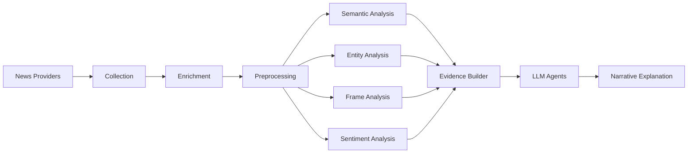
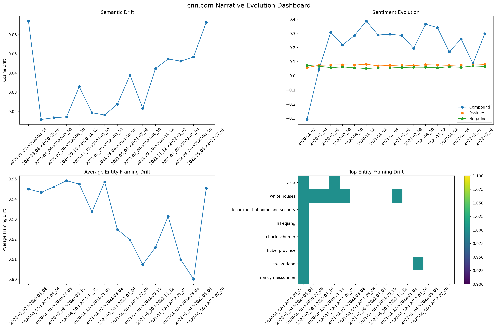
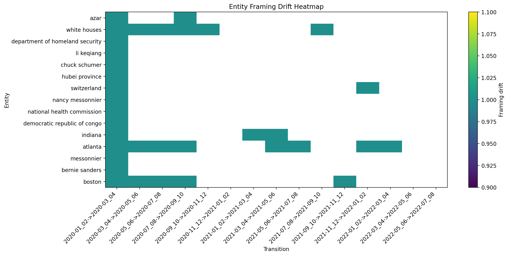

# Narrative Drift Detection

A research framework for detecting, analysing and explaining **narrative drift** in online news.

Developed as part of a Master's dissertation at the Technical University of Cluj-Napoca, the project combines semantic analysis, entity evolution, framing analysis, temporal segmentation and local large language models into a unified pipeline for longitudinal news analysis.

---

## Motivation

News narratives rarely change abruptly. Instead, they gradually evolve as new actors emerge, topics shift, sentiment changes and different outlets adopt new framing strategies.

This project aims to automatically identify these transitions and provide interpretable explanations supported by evidence extracted from the underlying articles.

---

## Main Features

- Multi-provider news collection
- Full-text enrichment
- Sentence embedding generation
- Semantic drift computation
- Named entity extraction and normalization
- Temporal entity evolution
- Latent frame discovery
- LLM-assisted frame labeling
- Narrative signatures
- Cross-source comparison
- Change-point detection
- Narrative regime analysis
- Sentiment and affective dynamics
- Editorial behaviour analysis
- Confidence scoring
- Evidence retrieval
- Multi-agent narrative explanation using Ollama

---

## High-Level Pipeline



---

## Project Structure

```text
src/
├── collector.py
├── enricher.py
├── main.py
├── providers/
├── preprocessing.py
├── database.py
├── embeddings.py
├── drift.py
├── entities.py
├── entity_normalization.py
├── temporal_entity_analysis.py
├── latent_frames.py
├── semantic_frame_labeling.py
├── narrative_signatures.py
├── signature_comparison.py
├── change_point_detection.py
├── changepoints.py
├── sentiment_analysis.py
├── affective_dynamics.py
├── editorial_behavior.py
├── evidence_packet_builder.py
├── agentic_llm/
├── agentic_explainers/
└── utils/
```

---

## Installation

```bash
python -m venv .venv
.venv\Scripts\activate

pip install -r requirements.txt

python -m spacy download en_core_web_sm
```

For local LLM support:

```bash
ollama pull qwen2.5:7b
ollama serve
```

---

## Usage

Collect metadata:

```bash
python src/collector.py
```

Extract article text:

```bash
python src/enricher.py
```

Run the complete analysis:

```bash
python src/main.py
```

Generate agent-based explanations:

```bash
python src/test_agentic_system.py
```

---

## Visualisations

## Narrative Dashboard



## Semantic Drift Across Sources


## Semantic vs Framing Drift


## Entity Framing Heatmap




---

## Technologies

- Python
- SQLite
- Sentence Transformers
- spaCy
- scikit-learn
- pandas
- NumPy
- ruptures
- VADER Sentiment
- Ollama

---

## Research Context

Unlike traditional concept drift detection, this framework studies how narratives evolve through multiple complementary perspectives. Instead of relying solely on semantic similarity, it integrates entity evolution, latent framing, sentiment dynamics, temporal change detection and evidence-driven LLM interpretation into a single research pipeline capable of identifying and explaining narrative shifts across time and news sources.
